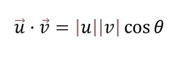
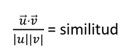

# Sistema de recomendación

La implementación de un sistema de recomendación ofrece varios beneficios al inversor. Proporciona personalización al recomendar criptomonedas que se ajustan a sus intereses y preferencias individuales, fomenta la diversificación de las inversiones al permitir a los usuarios descubrir nuevas criptomonedas y ahorra tiempo al evitar que tengan que buscar manualmente nuevas oportunidades de inversión.

Para el sistema de recomendación de criptomonedas de la sección Moneda Particular, se decidió utilizar un sistema de recomendación basado en contenido por varias razones. En primer lugar, su implementación suele ser más eficiente que la de sistemas colaborativos en contextos donde la información del usuario es escasa. Además, suele ser más transparente en la forma en que genera recomendaciones, lo que aumenta la confianza del usuario. Por último, se adapta mejor a los cambios en los intereses del usuario al considerar únicamente las características del contenido, en este caso de la moneda.

El desarrollo de este sistema se dividió en varias etapas.

## Establecer el conjunto de datos

Debido a la alta volatilidad en el mercado, se decidió utilizar un conjunto de datos que se centra en las cien principales criptomonedas según su capitalización de mercado. A pesar de que siempre existe un riesgo considerable en este ecosistema, optamos por recomendar solo las principales criptomonedas. Para estas recomendaciones, utilizamos exclusivamente las categorías a las que pertenece cada criptomoneda. Esto nos permitió diferenciar aquellas que son más similares según la cantidad de coincidencias y características en común.

## De texto a vector

En etapas posteriores, necesitamos trabajar con vectores para encontrar la similitud entre dos vectores. Por este motivo, realizamos la vectorización de texto de las categorías correspondientes a cada criptomoneda.

Debimos convertir la cadena de texto de manera inteligente para que los vectores representen el significado del texto. Es importante destacar que existen modelos avanzados, como BERT, capaces de convertir de manera inteligente oraciones en vectores, lo que permite representar el significado del texto de forma efectiva. Si bien BERT es una herramienta poderosa, para nuestro propósito actual no es necesario profundizar en su funcionamiento específico.

## Cálculo de similitud del coseno

La similitud del coseno es el coseno del ángulo entre vectores y está dada por la fórmula matemática del producto escalar:

Esta fórmula no es más que lo siguiente:

Con esta ecuación sobre la similitud entre vectores podemos calcular cómo de similares son dos vectores. Si nos fijamos, lo único que ha cambiado es que los términos |u| |v| se han movido para ser los divisores de la ecuación, mientras que el coseno de θ ha pasado a ser ese término nuevo que estamos introduciendo, qué es la similitud.

La parte superior de nuestra ecuación representa el producto escalar y la parte inferior es el producto del módulo de los vectores.

## Selección de resultados

Seleccionamos las 5 criptomonedas (vectores) con la mayor similitud coseno.
