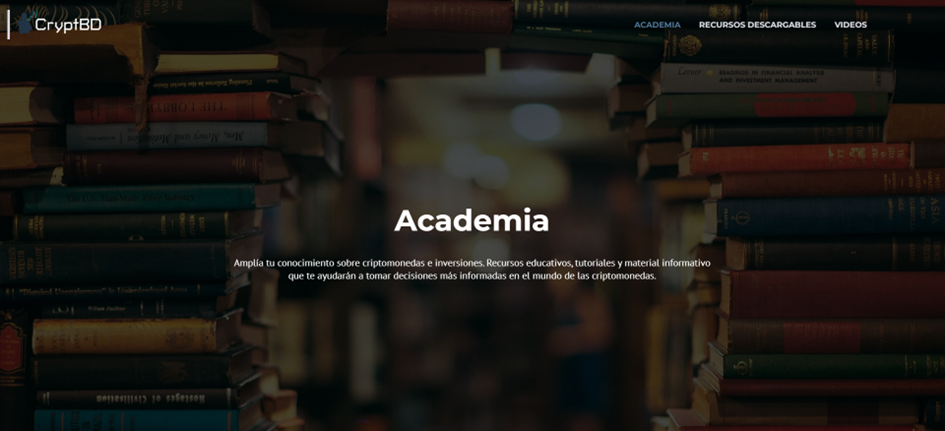

# Academia

El propósito central del módulo "Academia" es proporcionar a los usuarios una plataforma para resolver sus dudas, acceder a documentación esencial y fortalecer sus conocimientos sobre el mundo de las criptomonedas. Este módulo se divide en dos secciones: "Recursos descargables" y "Vídeos".

## Recursos descargables

Dentro de esta sección, se presentan una serie de documentos en formato PDF disponibles para su descarga por parte de los usuarios. Estos recursos se ofrecen de manera gratuita y están destinados a brindar un valioso apoyo, especialmente para aquellos usuarios que están dando sus primeros pasos en el mundo de las criptomonedas.

La intención detrás de estos materiales es proporcionar información accesible y de libre distribución que pueda servir como una valiosa fuente de conocimiento, ayudando a los usuarios a comprender mejor los conceptos clave relacionados con las criptomonedas.

## Videos

En esta sección del módulo, se incluyen en forma de carrusel tres canales de YouTube. Se eligieron estos canales debido a que tienen una gran comunidad que los sigue, son personas muy capacitadas y además, colaboraron para poder divulgar nuestras encuestas en la fase de análisis del proyecto. 

Los videos pertenecientes a estos canales son una valiosa fuente de información para principiantes, ya que ofrecen cursos de nivel inicial que abarcan una variedad de temas, desde la historia de las criptomonedas hasta estrategias de trading.

