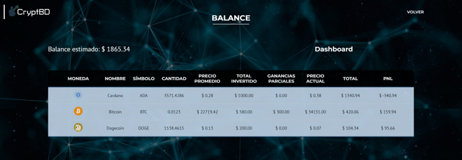
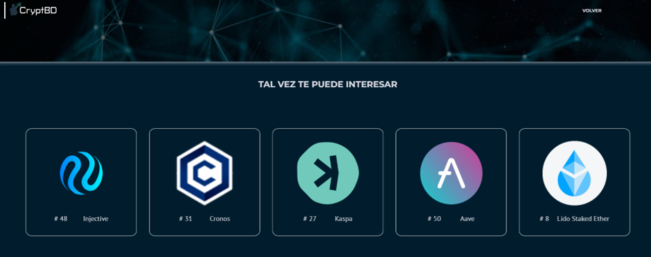

# Balance

La plantilla Balance proporciona una visión detallada de los activos del usuario. Esta información es generada por las transacciones que el usuario registra en el módulo “Transacciones". 

A través de una tabla, se presentan las criptomonedas que posee, acompañadas de información esencial como la cantidad, el precio promedio, el total invertido, las ganancias parciales, el precio actual y el total en dólares. 

Además, en la parte superior de la tabla, se muestra el balance estimado, que representa la suma de todos los totales. Esto permite a los usuarios obtener de manera rápida y eficaz una perspectiva general de sus criptomonedas.

En la parte inferior de la plantilla, se recomiendan cinco monedas basadas en el perfil del inversor.

