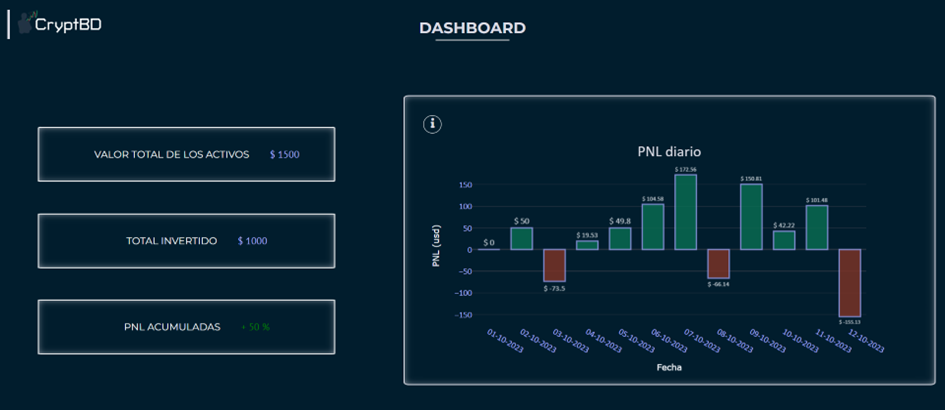

# Dashboard

En la plantilla Dashboard se presentan una serie de gráficos y estadísticas sobre los activos del usuario. De igual manera que en el módulo Balance, esta información es generada por las transacciones que el usuario registra. 

Cada uno de los gráficos generados son presentados en la plantilla con un propósito en particular, en la mayoría de ellos, al ser interactivos, el usuario puede cambiar el rango de fecha y de esa forma ver con mayor detalle los resultados. Junto a los gráficos, se presenta la información del valor total de los activos, el total invertido, el PNL acumulado, PNL total y cantidad de activos.

En total, son seis gráficos los presentes, y se describen a continuación.

#### PNL diario

Este gráfico muestra las ganancias o pérdidas diarias de una inversión en criptomonedas. Es útil para evaluar cómo fluctúa el valor de tu inversión día a día.

#### Valor neto de inversión

Este gráfico representa el valor neto de tu inversión en criptomonedas en un período de tiempo específico. Puede mostrar cómo ha evolucionado tu inversión con el tiempo y si has obtenido ganancias o pérdidas.

#### Distribución del capital invertido en criptomonedas

Este tipo de gráfico muestra cómo se distribuye tu capital invertido entre diferentes criptomonedas. Te ayuda a comprender en qué activos específicos has invertido y en qué proporción.

#### Ganancias y pérdidas

Este gráfico muestra las ganancias acumuladas a lo largo del tiempo. Puedes ver cuánto has ganado con tu inversión en criptomonedas en un período determinado.

#### PNL Acumulativo de activos

Este gráfico muestra las ganancias y pérdidas acumulativas para cada uno de los activos en los que has invertido. Te permite evaluar qué activos han sido los más rentables y cuáles han generado pérdidas.

#### PNL Acumulativo de activos vs BTC

Este gráfico compara las ganancias y pérdidas acumulativas de tus activos en criptomonedas con el rendimiento de Bitcoin (BTC), que a menudo se considera un punto de referencia en el mercado de criptomonedas. 

