# Estrategias y Simulación

Dentro de la plantilla Estrategia y Simulación, se encuentran las funcionalidades más atractivas y valiosas del sistema: la capacidad de crear estrategias y realizar simulaciones en el tiempo pasado.

Esta sección es uno de los pilares fundamentales del sistema, ya que la creación de estrategias y las simulaciones en el entorno de las criptomonedas son prácticas esenciales que ayudan a los inversores a tomar decisiones informadas, gestionar riesgos y mejorar sus posibilidades de éxito en un mercado altamente dinámico y volátil.

La plantilla se divide en dos secciones clave: “Estrategias” y “Qué Hubiera Pasado Si…”, las cuales se describen a continuación.

## Estrategias

En esta sección, los usuarios tienen la capacidad de crear y administrar estrategias de inversión. Pueden agregar y eliminar estrategias, y luego visualizarlas en una tabla. 

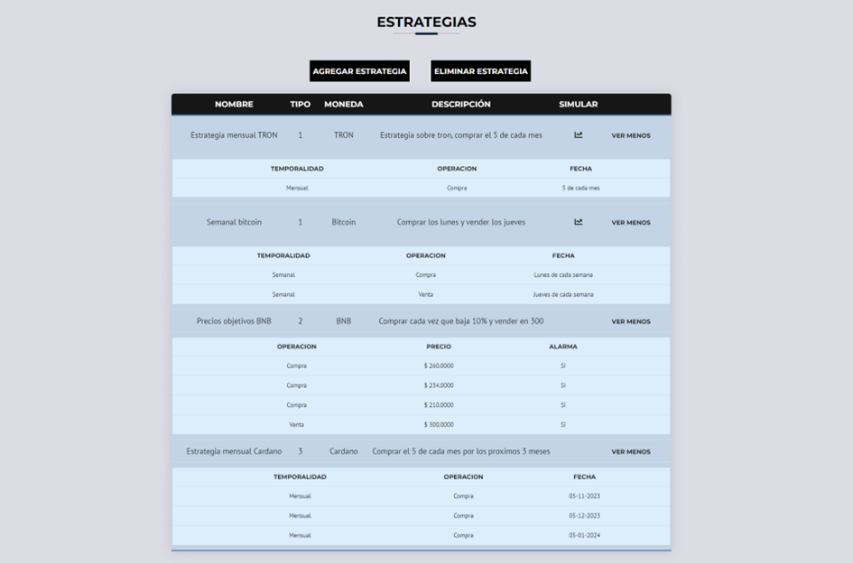

Al hacer clic en "Agregar Estrategia", el sistema presenta un formulario sencillo donde los usuarios pueden introducir los datos necesarios para que el sistema genere la estrategia.

Existen tres tipos de estrategias disponibles.

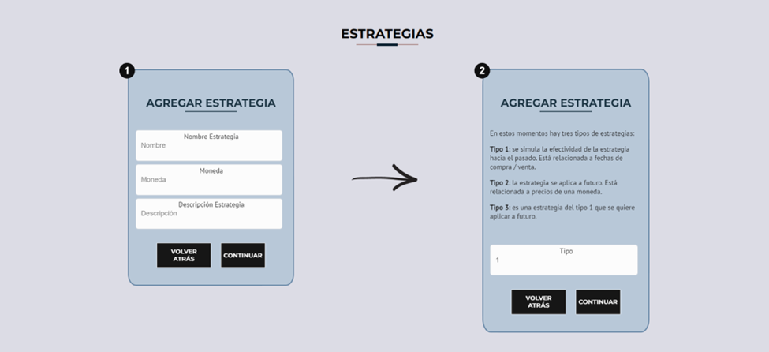

### Tipo 1

Estrategias de simulación que se basan en fechas de compra y venta, ya sea en intervalos semanales o mensuales.

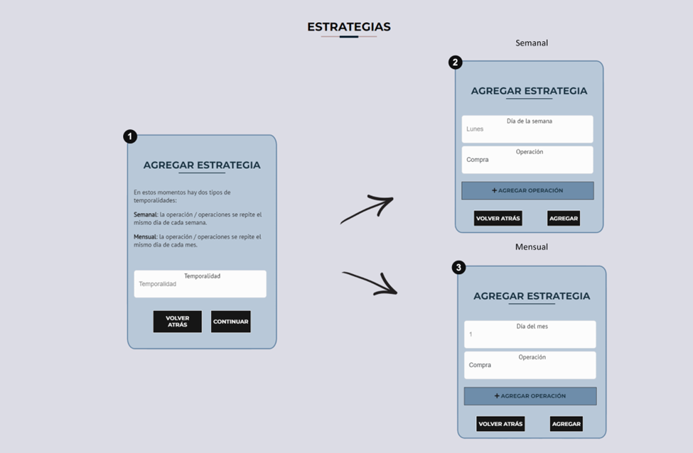

### Tipo 2

Estrategias que se aplican en el futuro y están relacionadas con los precios de una moneda. Los usuarios pueden establecer los precios a los que desean realizar operaciones.

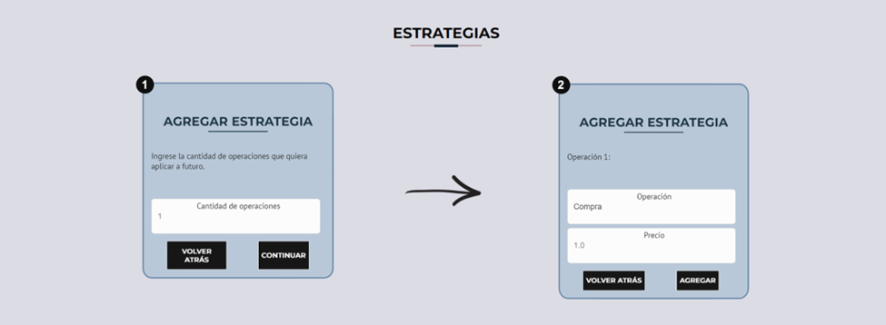

### Tipo 3

Estrategias de tipo 1 que también se desean aplicar en el futuro. Los usuarios pueden programar operaciones futuras y especificar el momento en que desean llevar a cabo la estrategia.

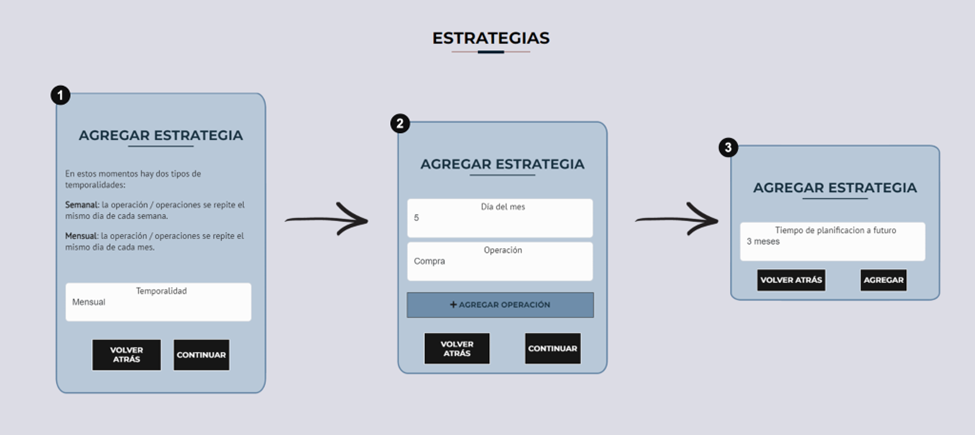

### Simulación de estrategias

Otra funcionalidad más que importante es la simulación de estrategias. Las estrategias de tipo 1 pueden ser simuladas al hacer clic en el botón correspondiente en la tabla. La simulación redirige al usuario a una nueva plantilla que presenta los resultados obtenidos.

La simulación de estrategias genera dos tipos de resultados claramente diferenciados. Por un lado, encontramos los resultados de simulaciones enfocadas exclusivamente en compras, donde el capital de inversión se incrementa o disminuye a lo largo del tiempo. Estas simulaciones están relacionadas con compras fijas en intervalos de tiempo predefinidos.

En primer lugar, se visualiza el rendimiento de la moneda a lo largo del período de tiempo necesario para proporcionar un contexto que facilite la comprensión de los resultados.

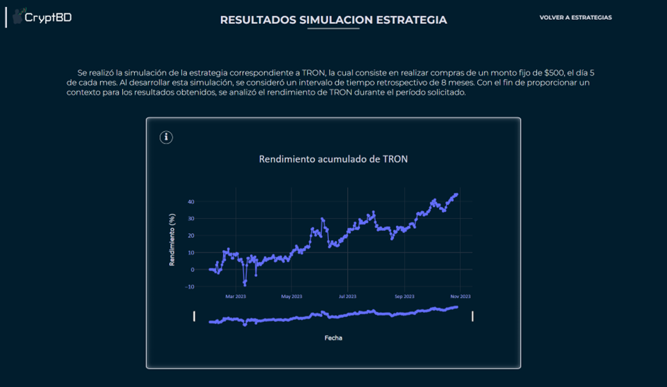

Luego, se presenta el cálculo del capital invertido sumado a los beneficios y pérdidas acumulados, acompañado de una breve explicación sobre los resultados. También se incluyen gráficos ilustrativos que muestran la evolución de las ganancias y pérdidas, así como el valor neto de la inversión a lo largo de ese intervalo de tiempo.

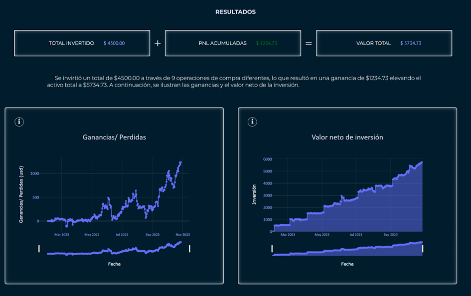

Por otro lado, tenemos los resultados de estrategias que abarcan tanto compras como ventas. Estas estrategias están más orientadas hacia el ámbito del trading, que consiste en realizar operaciones de compra y venta con el objetivo de obtener beneficios. En este caso, se evalúa la rentabilidad de la estrategia a lo largo del tiempo, determinando si las compras y ventas realizadas generan ganancias o pérdidas.

Al igual que en las estrategias de solo compra, primero se da un contexto del rendimiento de la moneda en cuestión.

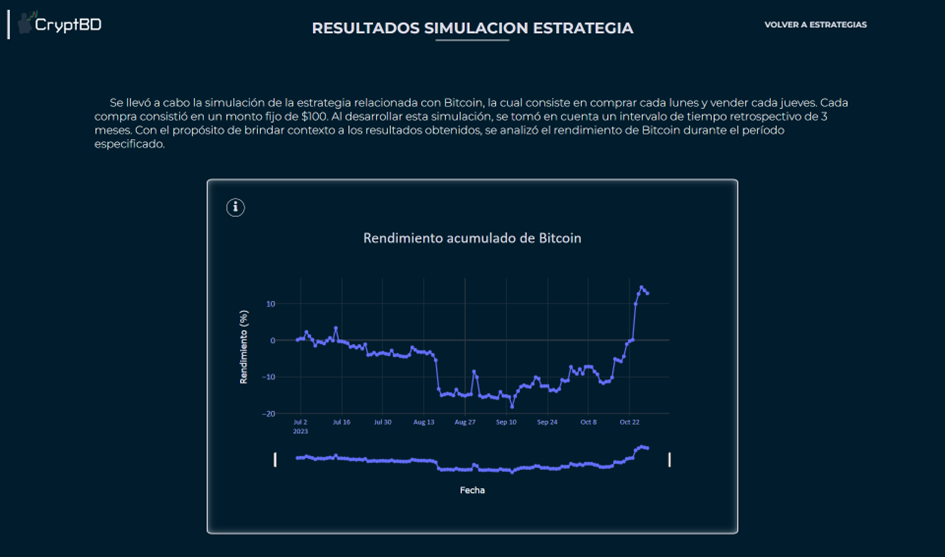

Posteriormente, exhibimos la cantidad de operaciones efectuadas, resaltando las operaciones exitosas y las que tuvieron pérdidas, junto con sus respectivos porcentajes.

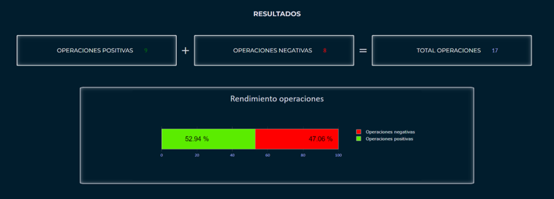

Para concluir, se presenta un breve resumen de los resultados, destacando el resultado de cada operación, así como los datos referentes a la operación más y menos beneficiosa.

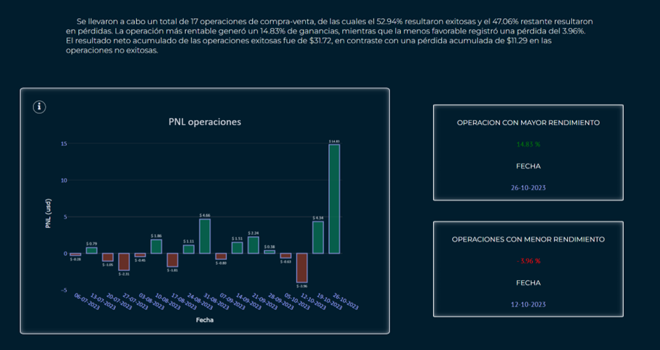

Estas dos categorías de resultados permiten a los usuarios comprender mejor el desempeño de sus estrategias y tomar decisiones informadas sobre sus inversiones en función de sus objetivos, ya sea el crecimiento a largo plazo o las ganancias a corto plazo mediante el trading.

## Qué hubiera pasado si… 

En esta sección, los usuarios tienen la capacidad de realizar simulaciones para determinar qué hubiera sucedido si hubieran comprado una moneda en una fecha específica. El sistema busca el precio de la moneda en esa fecha y proporciona los resultados de la simulación.

Luego se muestran los resultados obtenidos, detallando tanto el precio actual como el precio de la fecha proporcionada, junto con sus ganancias y pérdidas netas (pnl), y proporcionando un breve resumen de estos resultados.

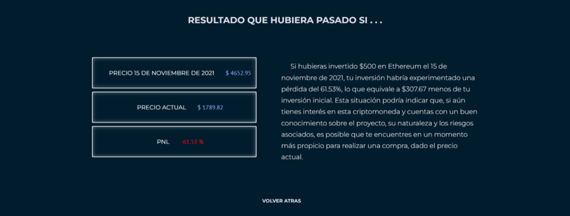

