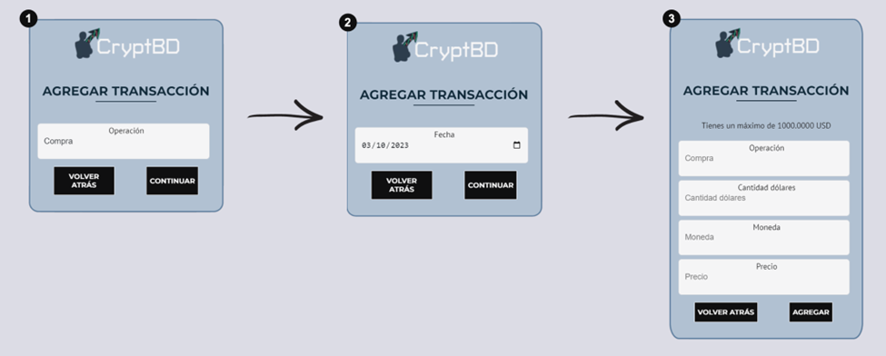
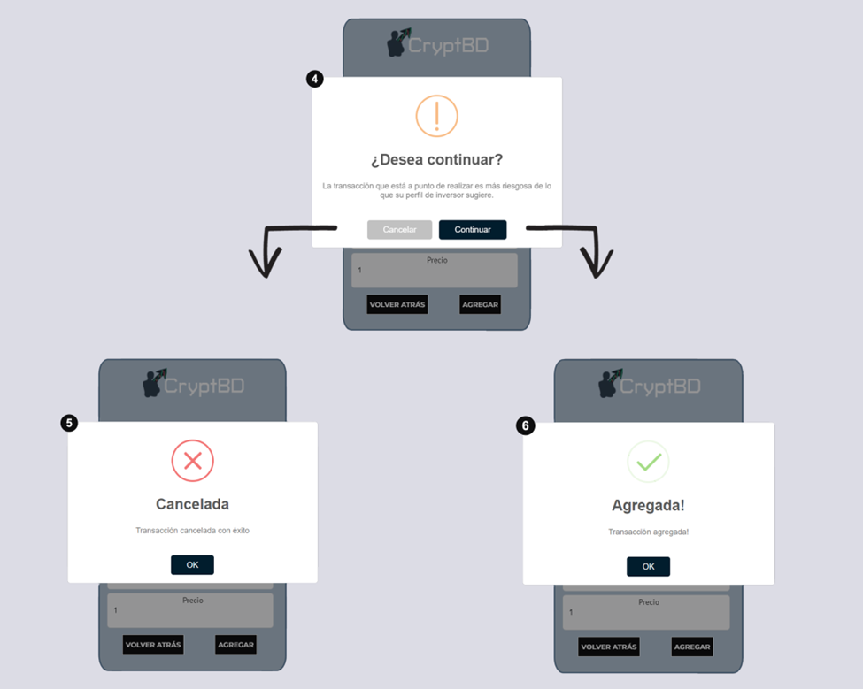

# Transacciones

Dentro de esta plantilla, el usuario puede gestionar un registro de las transacciones que ha realizado. Tiene la flexibilidad de añadir tanto las transacciones de compra como las de venta, y puede eliminarlas según su necesidad.

El sistema utiliza estos registros de transacciones proporcionados por el usuario para crear los gráficos y estadísticas que se muestran en el dashboard.

En primera instancia, antes de realizar una transacción, el inversor debe registrar su capital disponible de inversión. Para ello, debe indicar la fecha y la cantidad de dólares.

Posteriormente, el usuario podrá agregar transacciones tanto de compra como de venta, para ello debe seleccionar el tipo de operación (1), y la fecha (2). Automáticamente el sistema le mostrará el capital disponible en ese momento que se pretende llevar a cabo la operación. En este caso se mostrará una operación de compra (3).

Al momento de agregar la operación, si la moneda que se quiere comprar no coincide con el perfil del inversor, funcionalidad explicada en el módulo Login, se muestra un mensaje de advertencia (4). El usuario podrá cancelar la operación (5) o continuar con ella (6).

