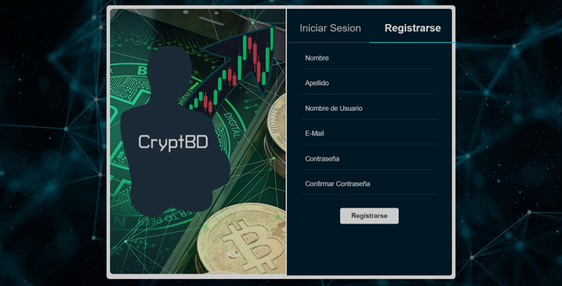
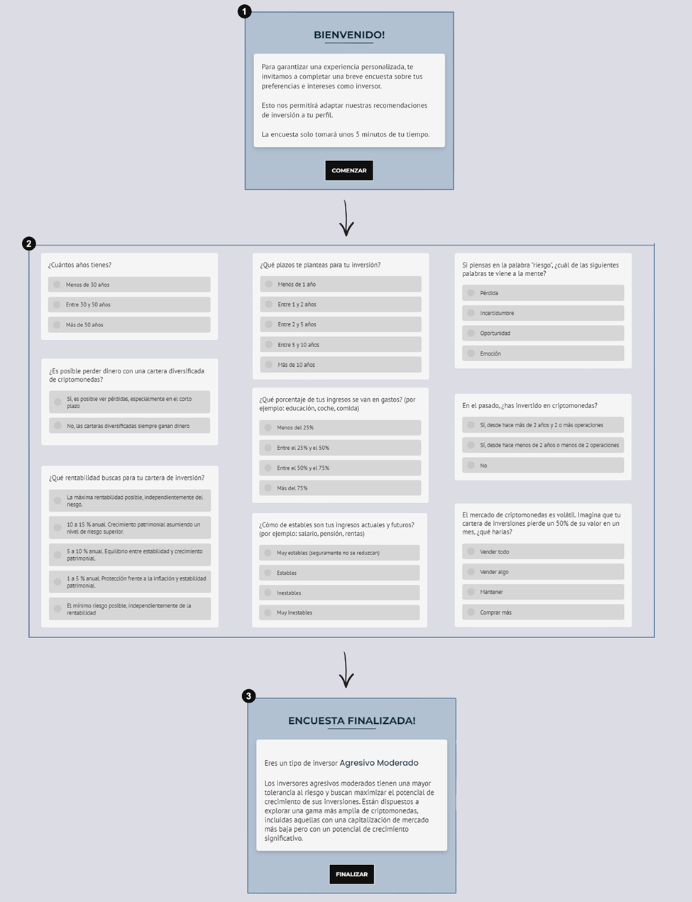

# Login

En este módulo, los usuarios pueden registrarse en el sistema al completar un formulario con los datos esenciales, garantizando en todo momento su anonimato y privacidad.

Una vez completado el formulario con los datos de registro, se notificará al usuario que a su vez debe completar una breve encuesta. (1)

Luego, se presentará un conjunto de preguntas seleccionadas estratégicamente para analizar y determinar el perfil del inversor. (2)

Estas preguntas se dividen en tres bloques. Para proceder al siguiente bloque, el inversor debe seleccionar una respuesta obligatoriamente para cada una de ellas.

Una vez que el inversor completa la encuesta, se muestra el perfil de inversor asignado y una breve descripción del mismo. (3)

Finalizado todo el proceso de registro, el usuario ya está en condiciones de iniciar sesión y aprovechar al máximo todas las funcionalidades del sistema al navegar por las diversas plantillas disponibles.

