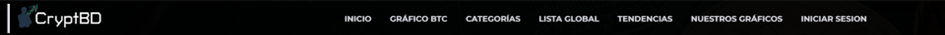
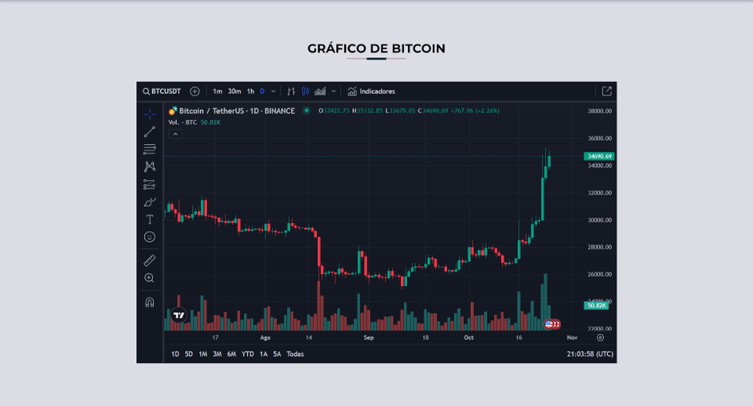
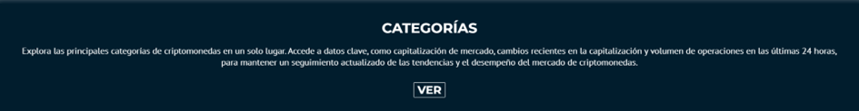
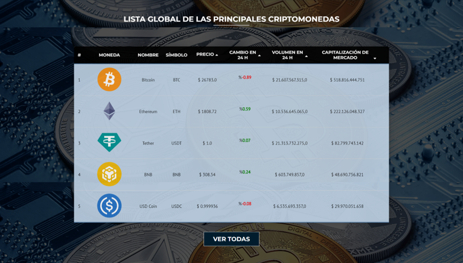
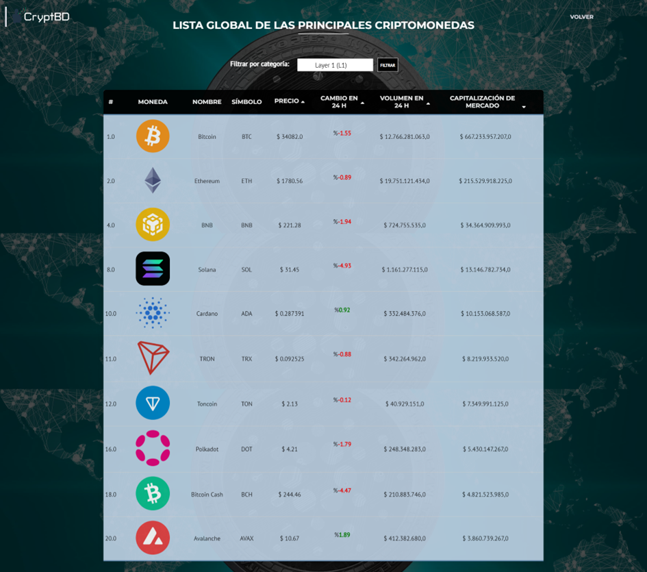
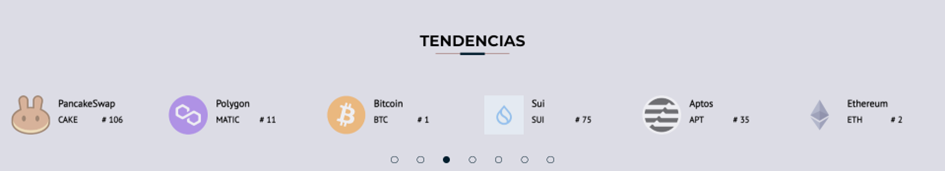
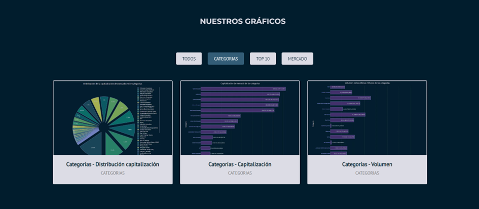
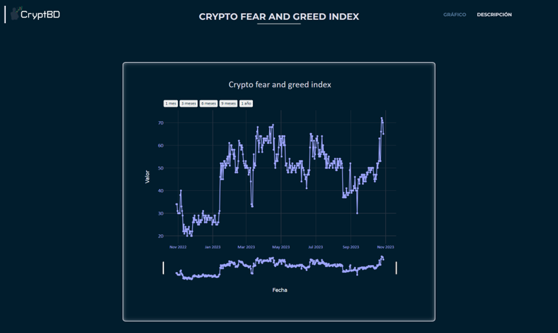
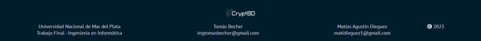

# Mercado General

El módulo Mercado General es uno de los más importantes debido a que es el home de nuestro sistema. Esto significa que es lo primero que los usuarios van a visualizar al ingresar, es por eso que se buscó que sea lo más profesional, completo y llamativo posible para que genere una buena primera impresión del sistema.

Esta plantilla está dividida en varias secciones las cuales se describen a continuación.

## Header - Barra de navegación

En este componente se encuentran todas las referencias de las secciones presentes en la plantilla. Al hacer clic en uno de estos enlaces, serás automáticamente llevado a la sección correspondiente.

La barra de navegación se mantiene fija en la parte superior de la pantalla, lo que significa que te seguirá mientras navegas por la página. Además, se realza visualmente la sección en la que te encuentras actualmente, facilitando la orientación en la página.

Por último, se encuentra un botón que te permite iniciar sesión o registrarte en el sistema. Al hacer clic en este botón, serás redirigido a la página de inicio de sesión o registro correspondiente, brindándote un acceso sencillo y rápido a tu cuenta.

## Hero

En este componente se encuentran los cuatro módulos pertenecientes al módulo Billetera, con su título y una breve descripción de lo que se puede encontrar en ellos.

## Acceso directo a los módulos

En este componente, se disponen accesos directos a cuatro módulos fundamentales del sistema, cada uno acompañado de un breve resumen que explica su función. Estos módulos son: Academia, Billetera, Watchlist y Novedades.

Al hacer clic en cualquiera de estos accesos directos, serás redirigido de inmediato al módulo seleccionado, permitiéndote acceder fácilmente a las funciones que necesitas.

## Gráfico de bitcoin

En esta sección del Mercado General, se incluye el gráfico de la moneda Bitcoin, esto se debe a que es la más importante en el mundo cripto. En este gráfico, se puede observar el precio, su variación temporal en un rango seleccionado, entre muchas otras funcionalidades.

## Categorías

En esta sección, se encuentra una tabla que lista las principales categorías de criptomonedas a nivel global. 

 

Al hacer clic en el botón "Ver", serás redirigido a una nueva página donde obtendrás información crucial, como la capitalización de mercado, las variaciones recientes en la capitalización y el volumen de operaciones en las últimas 24 horas.

 

## Lista Global

En esta sección, se encuentra una lista global de las principales criptomonedas presentada en forma de tabla. Esta tabla incluye información valiosa, como el logotipo de la moneda, el nombre, el símbolo, el precio actual, el cambio experimentado en las últimas 24 horas, las variaciones en el volumen durante el mismo período y la capitalización de mercado. Además, hemos implementado la funcionalidad de ordenar las columnas para facilitar tu búsqueda y análisis.

Si haces clic en cualquiera de las monedas listadas en la tabla, serás redirigido al módulo "Moneda Particular", que se describe con más detalle en secciones posteriores.

También hemos incluido un botón que te permite explorar las 100 monedas con mayor capitalización. Al hacerlo, serás dirigido a una nueva plantilla donde hemos habilitado la opción de filtrar las monedas por categorías, brindándote un enfoque aún más personalizado en tu búsqueda e investigación.

## Tendencias

En esta sección, presentamos las tendencias más destacadas del mercado de criptomonedas en un carrusel interactivo. Cuando haces clic en una de las monedas, el sistema te redirige de inmediato al módulo de "Moneda Particular".

## Gráficos

En esta sección, presentamos una variedad de gráficos de interés general, cada uno acompañado por una vista previa y su título correspondiente. Además, hemos incorporado una funcionalidad de filtro que te permite explorar los gráficos de acuerdo a varios criterios. Estos criterios incluyen categorías, top 10 criptomonedas, y datos del mercado general.

Cuando haces clic en cualquiera de estos gráficos, el sistema te redirige a una plantilla específica para ese gráfico en particular. Aquí, el gráfico se presenta en un formato más grande y detallado. 

Además, cada gráfico viene acompañado de una descripción que amplía la comprensión sobre su contenido.

## Footer

Esta sección se encuentra al final de cada plantilla del sistema web y proporciona la información necesaria sobre la universidad, el trabajo final y los nombres de los alumnos con sus correos de contacto, además de incluir un aviso de derechos de autor. 

