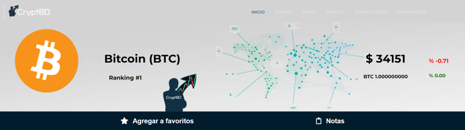
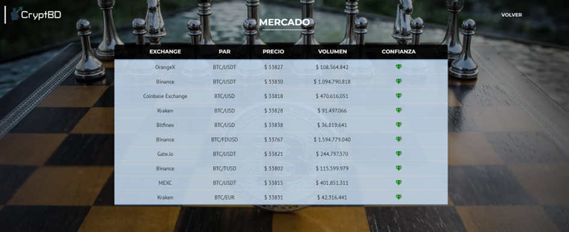

# Moneda Particular

En el módulo "Moneda Particular", los usuarios tienen la capacidad de explorar de manera detallada toda la información relacionada con una moneda específica. Esta plantilla es dinámica y se carga con los datos relevantes de la moneda seleccionada, lo que significa que la información que se presenta varía en función de la moneda elegida.

Este módulo se divide en varias secciones y ofrece múltiples funcionalidades, las cuales se describen a continuación.

## Inicio

En la parte superior de la plantilla, justo debajo de la barra de navegación, se encuentra esta sección. Aquí, los usuarios pueden visualizar información resumida de la moneda seleccionada, que incluye su logo, nombre, precio actual, variación en las últimas 24 horas y, justo debajo, su equivalente en Bitcoin.

Además, en esta sección, los usuarios tienen la capacidad de agregar la moneda a su lista de favoritos y tomar notas relacionadas con ella. Es importante destacar que estas funcionalidades solo están disponibles para usuarios que hayan iniciado sesión en el sistema.

Las monedas que los usuarios agregan a su lista de favoritos se pueden visualizar en el módulo "Watchlist", el cual describiremos en detalle más adelante.

Las notas son persistentes en el tiempo y podrán ser visualizadas cada vez que el usuario ingrese en la página de esa moneda.

## General

En la sección "General", los usuarios pueden acceder a datos esenciales de la moneda, que incluyen información sobre la capitalización de mercado, volumen de operaciones, cantidad circulante y la cantidad máxima de monedas en circulación.

Además, esta sección ofrece una serie de accesos directos a recursos relacionados con la moneda, como el sitio web oficial, exploradores de bloques, la comunidad en línea y repositorios de información adicional.

Por último, se proporciona información sobre la categoría a la que pertenece, lo que ayuda a los usuarios a comprender su contexto y relevancia en el mercado de criptomonedas.

## Datos

La sección "Datos" presenta dos indicadores clave: uno relacionado con la variación del precio en las últimas 24 horas y otro centrado en el sentimiento de la comunidad. Estos indicadores proporcionan a los usuarios una visión general de cómo se percibe la moneda en el mercado y la comunidad.

Adicionalmente, hemos incorporado un práctico convertidor de moneda que permite a los usuarios realizar conversiones rápidas y precisas entre la moneda en cuestión y el dólar estadounidense.

## Gráfico

En esta sección, se encuentra el gráfico de la moneda. Este gráfico proporciona información detallada sobre el precio y su variación en un rango de tiempo específico, entre otras funcionalidades de análisis.

## Sobre la moneda

Dentro de esta sección de la plantilla, los usuarios encontrarán cuatro componentes: Mercado, Datos Históricos, Página Oficial y Novedades. Cada uno de estos desempeña un papel importante en la exploración de la moneda y su contexto en el mercado. A continuación, describimos en detalle cada uno de ellos.

### Mercado

Este componente te redirige a una nueva plantilla que presenta información detallada sobre los exchanges en los que la moneda está disponible para negociar. Aquí, los usuarios pueden consultar el precio, volumen y nivel de confianza asociados a cada exchange.

### Datos Históricos

Al hacer clic en este componente, serás dirigido a una plantilla que almacena datos históricos relacionados con el precio, volumen y capitalización de mercado de la moneda en un rango de días específico. Esta sección ofrece una perspectiva valiosa sobre la evolución de la moneda con el tiempo.

### Página Oficial

Como su nombre indica, este componente te lleva directamente a la página oficial de la moneda. Aquí, los usuarios pueden obtener información de primera mano y acceder a recursos adicionales proporcionados por los desarrolladores de la moneda.

### Novedades

Al hacer clic en este componente, serás dirigido al módulo “Novedades”, que se describe más adelante.

## Información de la moneda

En esta sección se presenta información adicional sobre la moneda, se explica sobre la historia, principales beneficios entre otras cosas.

## Tal vez te puede interesar

En esta sección de la plantilla se muestran un conjunto de monedas seleccionadas mediante el sistema de recomendación implementado. Al hacer clic en alguna de ellas, el sistema te llevará directamente a la página de esa moneda en particular.

