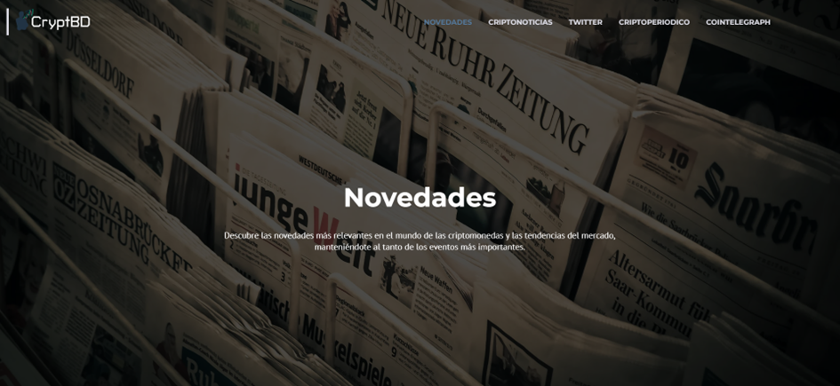
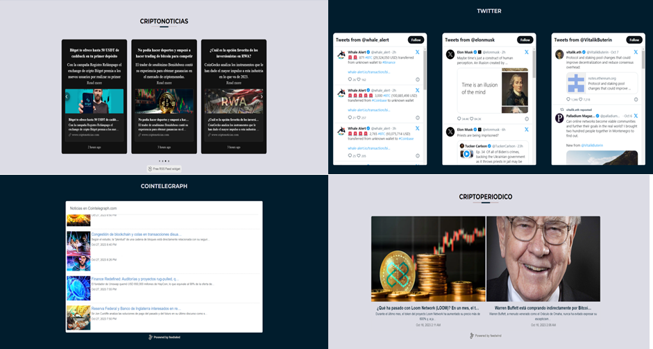

# Novedades

El módulo "Novedades" se constituye como una fuente de información en tiempo real sobre el mundo de las criptomonedas. Su objetivo principal es proporcionar a los usuarios una plataforma que les permita mantenerse al tanto de los acontecimientos más recientes.

Este módulo ofrece de manera visual y altamente intuitiva un conjunto de accesos directos a diversas fuentes de noticias relacionadas con las criptomonedas. Los usuarios pueden explorar desde aquí los tweets de influyentes figuras de la comunidad cripto, así como ver alertas sobre transferencias de grandes volúmenes de dinero, lo que proporciona una comprensión en tiempo real de las tendencias y eventos importantes en el mercado. 

