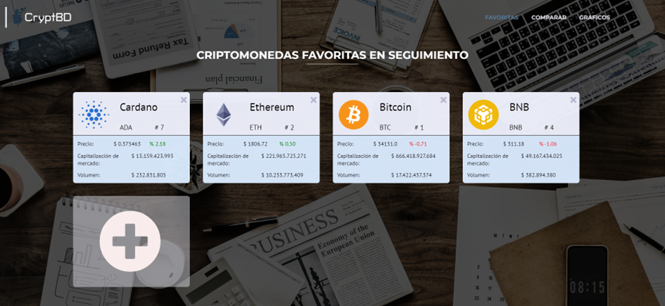
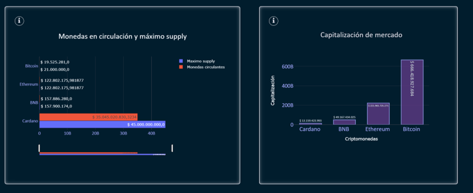
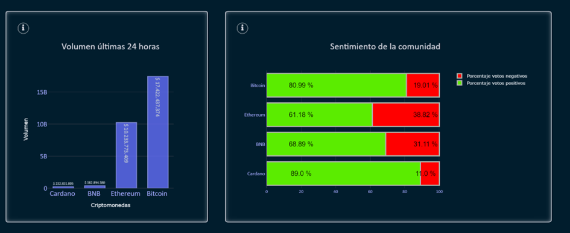
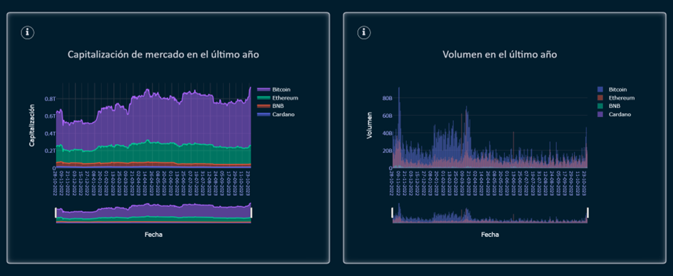

# Watchlist

Dentro de este módulo, los usuarios pueden acceder a la lista de monedas que han marcado como favoritas para un seguimiento personalizado. Además de visualizar estas monedas, los usuarios tienen la opción de compararlas y generar gráficos para un análisis detallado. A continuación, describimos estas funcionalidades.

## Favoritas

En primer lugar, se presenta una lista de las monedas que el usuario ha marcado como favoritas, ofreciendo la flexibilidad de eliminar las que ya no son de interés o de agregar nuevas. Cada moneda se representa en forma de tarjeta, y estas tarjetas proporcionan una serie de datos fundamentales, incluyendo el precio actual, la capitalización de mercado y el volumen de operaciones.

Al hacer clic en una de estas tarjetas, el sistema te redirigirá al módulo de "Moneda Particular", lo que te permitirá explorar con más detalle la moneda seleccionada. Esta funcionalidad facilita un acceso rápido y sencillo a la información detallada de las monedas favoritas.

## Gráficos comparativos

Dentro de esta sección de la plantilla, los usuarios tienen la capacidad de seleccionar un mínimo de dos y hasta cuatro monedas para generar gráficos comparativos. Sin embargo, es importante destacar que estas monedas deben estar previamente agregadas en la lista de favoritos del usuario para poder ser comparadas.

Es relevante mencionar que, dado que esta funcionalidad se encuentra en una versión beta del sistema, se ha implementado un temporizador de sesenta segundos. Esta medida tiene como objetivo evitar que se realicen múltiples peticiones a la API en un corto período de tiempo.

Los gráficos generados ofrecen una amplia gama de información relevante para el análisis de las monedas. A continuación, se describen los tipos de gráficos comparativos disponibles:

#### Monedas en circulación y máximo supply

Este gráfico comparativo presenta una visión de los suministros máximos y totales de monedas en circulación de cada moneda seleccionada.

#### Capitalización de mercado

Proporciona un gráfico comparativo de la capitalización de mercado total de cada una de las monedas, lo que facilita la evaluación de su posición relativa en el mercado.

#### Volumen en las últimas 24 horas

Un gráfico de barras que compara el volumen total de transacciones para cada moneda en las últimas 24 horas, lo que refleja la actividad reciente en el mercado.

#### Sentimiento de la comunidad

Ofrece un análisis comparativo del sentimiento de la comunidad en las últimas 24 horas con respecto a cada moneda, lo que puede ser indicativo de su popularidad y percepción en el mercado.

#### Capitalización de mercado en el último año

Este gráfico de área permite comparar la capitalización de mercado de cada moneda en el transcurso del último año, lo que ayuda a identificar tendencias a largo plazo.

#### Volumen en el último año

Presenta un gráfico de barras que compara el volumen de transacciones durante el último año para cada moneda, lo que proporciona una perspectiva histórica de su actividad en el mercado.

Estos gráficos comparativos ofrecen a los usuarios una herramienta poderosa para analizar y comparar diferentes aspectos de las monedas, lo que les permite tomar decisiones más informadas en sus inversiones y seguimiento del mercado.