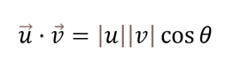
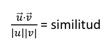

# Recommendation System

Implementing a recommendation system offers several benefits to investors. It provides personalization by recommending cryptocurrencies that align with their individual interests and preferences, promotes investment diversification by allowing users to discover new cryptocurrencies, and saves time by avoiding manual searches for new investment opportunities.

For the cryptocurrency recommendation system in the "Specific Currency" section, a content-based recommendation system was chosen for several reasons. Firstly, its implementation is often more efficient than collaborative systems in contexts where user information is sparse. Additionally, it is typically more transparent in how it generates recommendations, which enhances user trust. Lastly, it adapts better to changes in user interests by considering only the content features, in this case, the cryptocurrency characteristics.

The development of this system was divided into several stages.

## Establishing the Dataset

Due to the high volatility in the market, we decided to use a dataset focusing on the top one hundred cryptocurrencies by market capitalization. Although there is always considerable risk in this ecosystem, we opted to recommend only the top cryptocurrencies. For these recommendations, we used only the categories each cryptocurrency belongs to. This allowed us to differentiate those that are more similar based on the number of matches and shared features.

## From Text to Vector

In subsequent stages, we needed to work with vectors to find the similarity between two vectors. Therefore, we performed text vectorization for the categories corresponding to each cryptocurrency.

We had to convert text strings intelligently so that vectors represent the meaning of the text. It's important to note that advanced models like BERT can intelligently convert sentences into vectors, effectively representing the text's meaning. While BERT is a powerful tool, it's not necessary to delve into its specific functioning for our current purpose.

## Cosine Similarity Calculation

Cosine similarity is the cosine of the angle between vectors and is given by the mathematical formula for the dot product:

This formula is essentially:

With this equation for vector similarity, we can calculate how similar two vectors are. Notice that the only change is that the terms |u| |v| have become the divisors of the equation, while the cosine of θ has become the new term we are introducing, which is the similarity.

The top part of our equation represents the dot product, and the bottom part is the product of the magnitudes of the vectors.

## Result Selection

We select the top 5 cryptocurrencies (vectors) with the highest cosine similarity.
