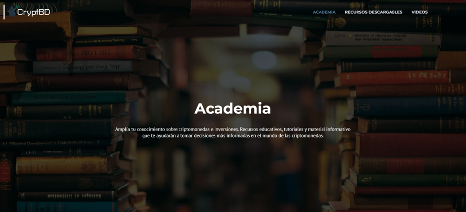
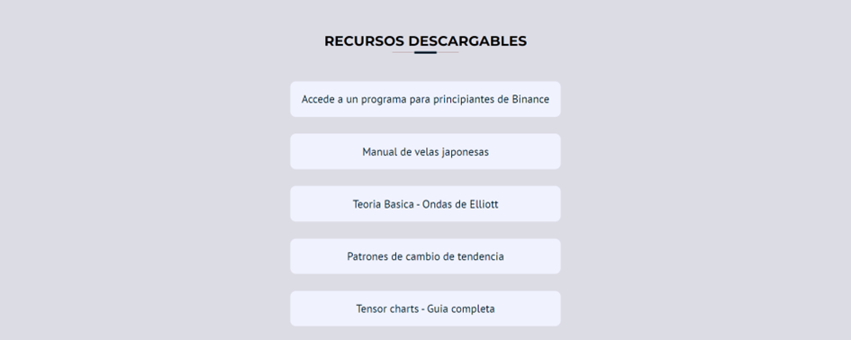

# Academy

The central purpose of the "Academy" module is to provide users with a platform to resolve their doubts, access essential documentation, and strengthen their knowledge about the world of cryptocurrencies. This module is divided into two sections: "Downloadable Resources" and "Videos."

## Downloadable Resources

In this section, a series of PDF documents are available for download by users. These resources are offered free of charge and are intended to provide valuable support, especially for users who are taking their first steps into the world of cryptocurrencies.

The intention behind these materials is to provide accessible and freely distributed information that can serve as a valuable source of knowledge, helping users to better understand key concepts related to cryptocurrencies.

## Videos

This section of the module includes three YouTube channels in a carousel format. These channels were chosen because they have a large following, feature highly qualified individuals, and also collaborated to help distribute our surveys during the project's analysis phase.

The videos from these channels are a valuable source of information for beginners, offering introductory courses that cover a range of topics, from the history of cryptocurrencies to trading strategies.

