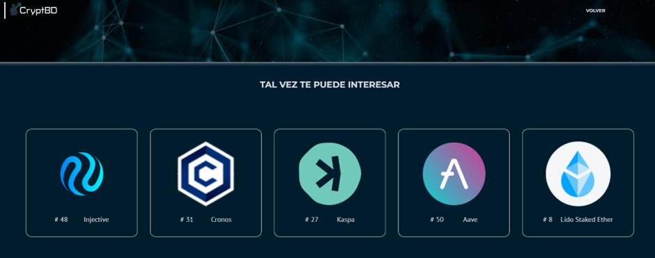

# Balance

The Balance template provides a detailed view of the user's assets. This information is generated by the transactions the user records in the "Transactions" module.

Through a table, it presents the cryptocurrencies owned, accompanied by essential information such as quantity, average price, total invested, partial gains, current price, and total in dollars.

Additionally, at the top of the table, the estimated balance is shown, representing the sum of all totals. This allows users to quickly and effectively get an overview of their cryptocurrencies.

At the bottom of the template, five coins are recommended based on the investor's profile.

