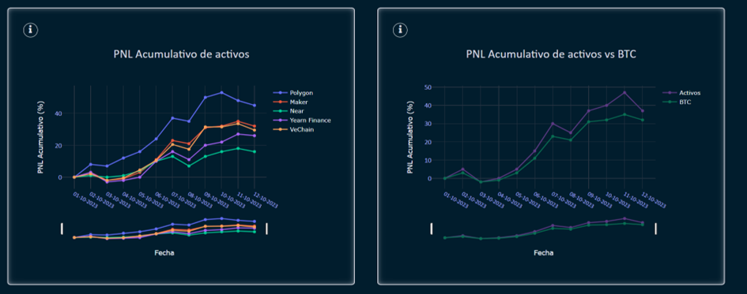

# Dashboard

The Dashboard template displays a series of charts and statistics about the user's assets. Just like in the Balance module, this information is generated by the transactions that the user records.

Each of the generated charts is presented in the template with a specific purpose. Most of them are interactive, allowing the user to change the date range and view the results in more detail. Alongside the charts, the template presents information on the total value of assets, the total invested, accumulated PNL, total PNL, and the number of assets.

In total, there are six charts, described as follows:

#### Daily PNL

This chart shows the daily gains or losses from cryptocurrency investments. It is useful for assessing how the value of your investment fluctuates from day to day.

#### Net Investment Value

This chart represents the net value of your cryptocurrency investment over a specific period. It can show how your investment has evolved over time and whether you have gained or lost money.

#### Distribution of Invested Capital in Cryptocurrencies

This type of chart shows how your invested capital is distributed among different cryptocurrencies. It helps you understand which specific assets you have invested in and in what proportion.

#### Profits and Losses

This chart displays the accumulated profits and losses over time. You can see how much you have earned or lost from your cryptocurrency investments over a given period.

#### Accumulated Asset PNL

This chart shows the accumulated gains and losses for each of the assets you have invested in. It allows you to evaluate which assets have been the most profitable and which have incurred losses.

#### Accumulated Asset PNL vs BTC

This chart compares the accumulated gains and losses of your cryptocurrency assets with the performance of Bitcoin (BTC), which is often considered a benchmark in the cryptocurrency market.

