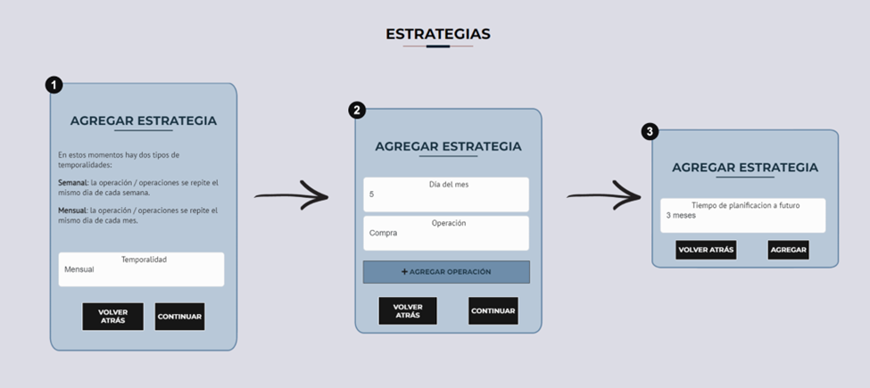

# Strategies and Simulation

Within the Strategies and Simulation template, users find the most attractive and valuable functionalities of the system: the ability to create strategies and perform simulations on past data.

This section is one of the system's fundamental pillars, as creating strategies and performing simulations in the cryptocurrency environment are essential practices that help investors make informed decisions, manage risks, and improve their chances of success in a highly dynamic and volatile market.

The template is divided into two key sections: “Strategies” and “What Would Have Happened If…”, described below.

## Strategies

In this section, users have the ability to create and manage investment strategies. They can add and remove strategies and then view them in a table.

By clicking on "Add Strategy," the system presents a simple form where users can enter the necessary data for the system to generate the strategy.

There are three types of strategies available.

### Type 1

Simulation strategies based on purchase and sale dates, either in weekly or monthly intervals.

### Type 2

Strategies applied in the future and related to the prices of a coin. Users can set the prices at which they want to execute trades.

### Type 3

Type 1 strategies that are also intended to be applied in the future. Users can schedule future trades and specify the time they want to execute the strategy.

### Strategy Simulation

Another important functionality is strategy simulation. Type 1 strategies can be simulated by clicking the corresponding button in the table. The simulation redirects the user to a new template displaying the results obtained.

Strategy simulations generate two clearly differentiated types of results. On one hand, there are simulation results focused exclusively on purchases, where the investment capital increases or decreases over time. These simulations relate to fixed purchases at predefined time intervals.

First, the performance of the coin over the period is shown to provide context that facilitates understanding the results.

Next, the calculation of the invested capital along with accumulated profits and losses is presented, along with a brief explanation of the results. Illustrative charts showing the evolution of gains and losses, as well as the net investment value over that time interval, are also included.

On the other hand, there are results from strategies involving both purchases and sales. These strategies are more oriented toward trading, which involves buying and selling to generate profits. In this case, the profitability of the strategy over time is evaluated, determining whether the trades result in gains or losses.

As with the purchase-only strategies, the performance of the coin is first provided for context.

Subsequently, the number of trades executed is displayed, highlighting successful trades and those that resulted in losses, along with their respective percentages.

Finally, a brief summary of the results is presented, highlighting the outcome of each trade, as well as data on the most and least profitable trades.

These two categories of results allow users to better understand the performance of their strategies and make informed decisions about their investments based on their goals, whether for long-term growth or short-term gains through trading.

## What Would Have Happened If…

In this section, users can perform simulations to determine what would have happened if they had bought a coin on a specific date. The system retrieves the coin's price on that date and provides the simulation results.

The results obtained are then displayed, detailing both the current price and the price on the given date, along with net gains and losses (PNL), and providing a brief summary of these results.

