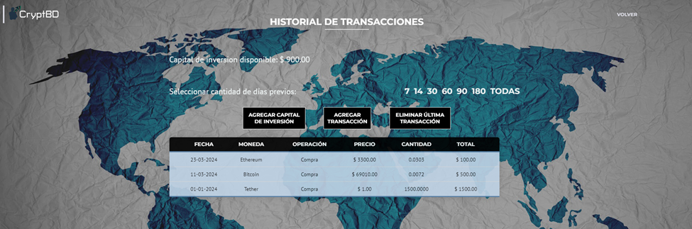

# Transactions

In this template, the user can manage a record of the transactions they have made. They have the flexibility to add both purchase and sale transactions and can delete them as needed.

The system uses these transaction records provided by the user to create the charts and statistics displayed on the dashboard.

Initially, before making a transaction, the investor must register their available investment capital. To do this, they need to specify the date and the amount in dollars.

Subsequently, the user can add both purchase and sale transactions. To do this, they must select the type of operation (1) and the date (2). The system will automatically display the available capital at that moment intended for the operation. In this case, a purchase operation is shown (3).

When adding the operation, if the coin to be purchased does not match the investor's profile, a warning message (4) is shown, as explained in the Login module. The user can either cancel the operation (5) or continue with it (6).

