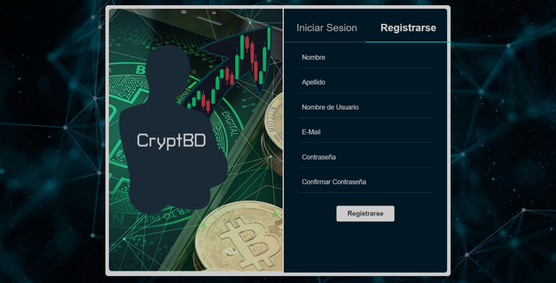
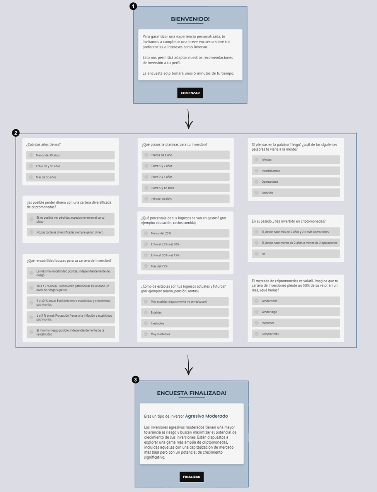

# Login

In this module, users can register in the system by completing a form with essential data, ensuring their anonymity and privacy at all times.

Once the registration form is completed, the user will be notified that they must also complete a brief survey. (1)

Next, a set of strategically selected questions will be presented to analyze and determine the investor's profile. (2)

These questions are divided into three blocks. To proceed to the next block, the investor must select a mandatory answer for each question.

After completing the survey, the assigned investor profile and a brief description of it will be shown. (3)

Once the registration process is complete, the user can log in and take full advantage of all the system's functionalities by navigating through the various available templates.

