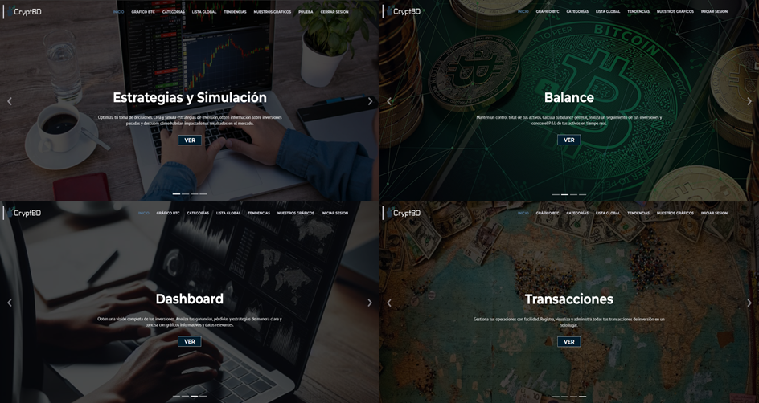
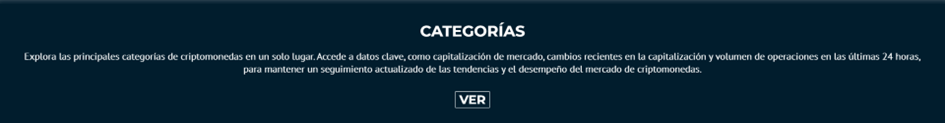
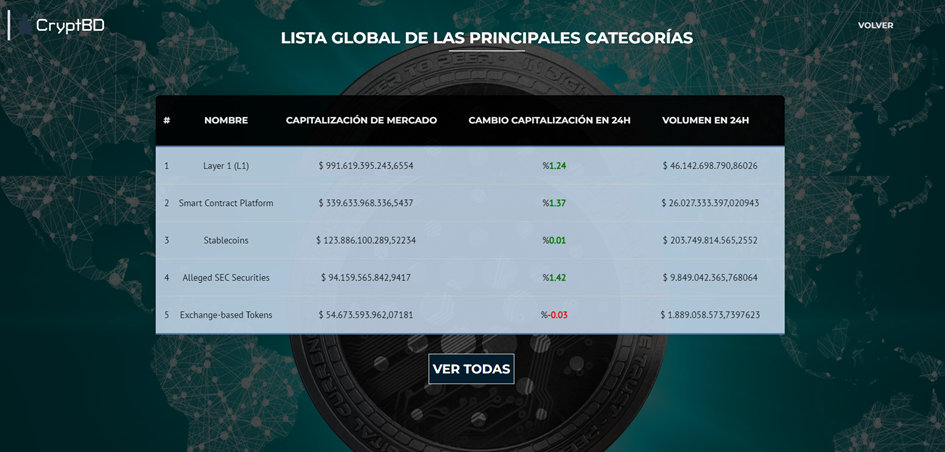
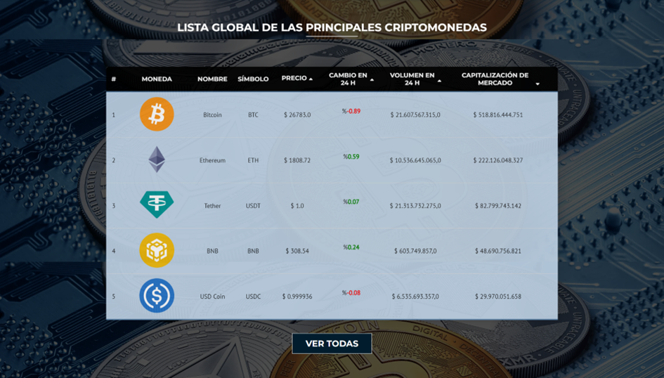
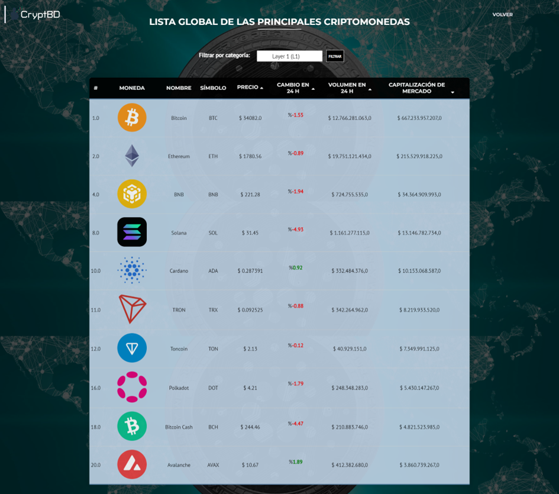
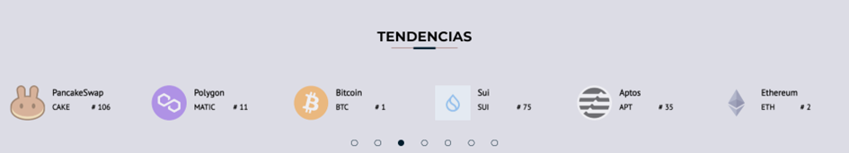
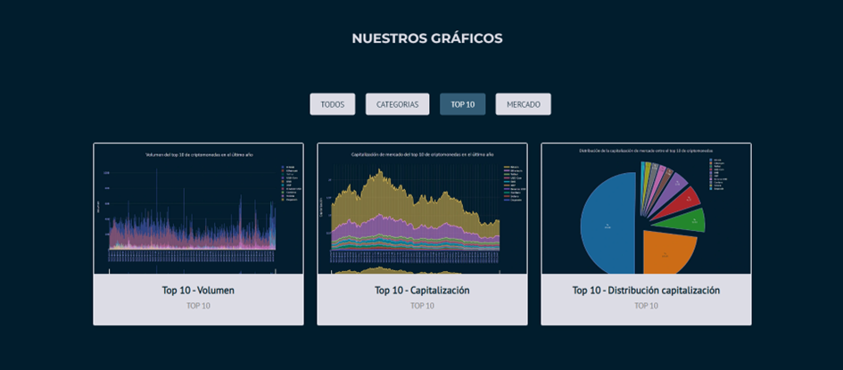
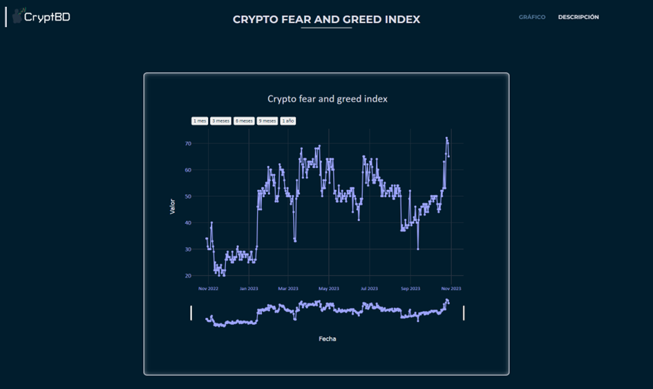
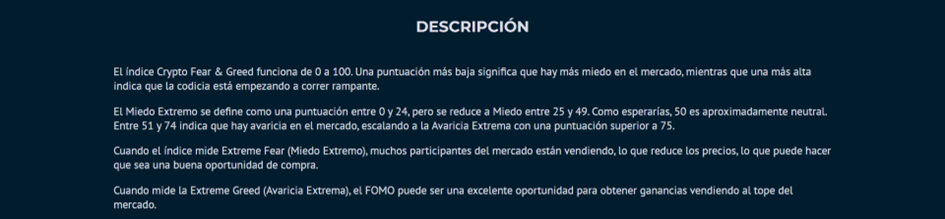
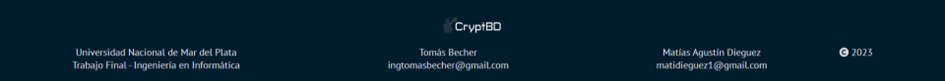

# General Market

The General Market module is one of the most important as it serves as the home page of our system. This means it's the first thing users will see upon entering, so it has been designed to be as professional, comprehensive, and visually appealing as possible to create a good first impression of the system.

This template is divided into several sections, which are described below.

## Header - Navigation Bar

This component contains all the references to the sections present in the template. By clicking on one of these links, you will be automatically taken to the corresponding section.

The navigation bar remains fixed at the top of the screen, meaning it will follow you as you navigate the page. Additionally, the section you are currently in is visually highlighted, making it easier to orient yourself on the page.

Finally, there is a button that allows you to log in or register in the system. Clicking this button will redirect you to the login or registration page, providing easy and quick access to your account.

## Hero

In this component, the four modules belonging to the Wallet module are displayed, with their title and a brief description of what can be found in each.

## Direct Access to Modules

In this component, direct access to four fundamental modules of the system is provided, each accompanied by a brief summary explaining its function. These modules are: Academy, Wallet, Watchlist, and News.

Clicking on any of these direct access buttons will immediately redirect you to the selected module, allowing you to easily access the functions you need.

## Bitcoin Chart

In this section of the General Market, the Bitcoin chart is included, as it is the most important in the crypto world. In this chart, you can observe the price, its temporal variation within a selected range, among many other features.

## Categories

In this section, a table lists the main categories of cryptocurrencies globally.

Clicking the "View" button will redirect you to a new page where you will get crucial information, such as market capitalization, recent changes in capitalization, and trading volume in the last 24 hours.

## Global List

In this section, a global list of the top cryptocurrencies is presented in table format. This table includes valuable information such as the coin's logo, name, symbol, current price, change experienced in the last 24 hours, volume variations during the same period, and market capitalization. We have also implemented column sorting functionality to facilitate your search and analysis.

Clicking on any of the listed coins in the table will redirect you to the "Coin Page" module, which is described in more detail in later sections.

We have also included a button that allows you to explore the top 100 coins by market capitalization. Doing so will direct you to a new template where we have enabled the option to filter coins by categories, providing you with an even more personalized approach to your search and research.

## Trends

In this section, we present the most prominent trends in the cryptocurrency market in an interactive carousel. Clicking on one of the coins will immediately redirect you to the "Coin Page" module.

## Charts

In this section, a variety of general interest charts are presented, each accompanied by a preview and its corresponding title. Additionally, we have incorporated a filter functionality that allows you to explore the charts based on various criteria. These criteria include categories, top 10 cryptocurrencies, and general market data.

Clicking on any of these charts will redirect you to a specific template for that particular chart. Here, the chart is presented in a larger and more detailed format.

Each chart also comes with a description that enhances understanding of its content.

## Footer

This section appears at the bottom of each template on the web system and provides necessary information about the university, the final project, and the names of students with their contact emails, in addition to including a copyright notice.

