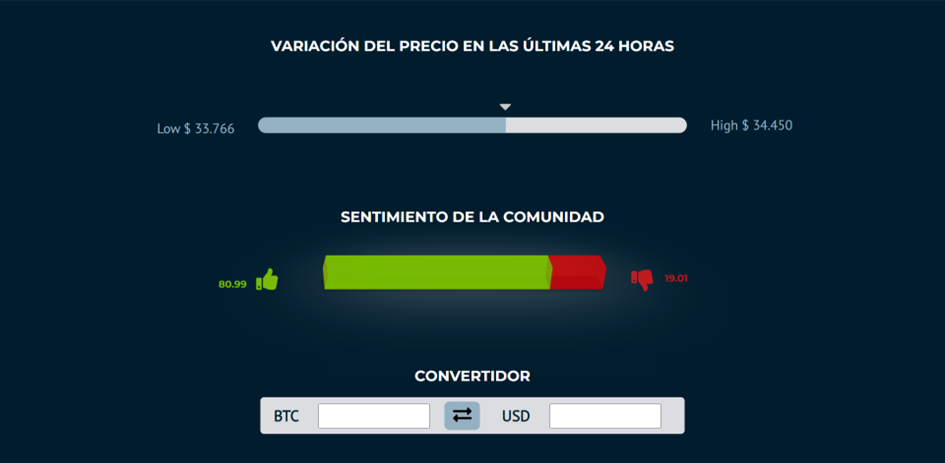

# Coin Page

In the "Coin Page" module, users can delve into detailed information about a specific cryptocurrency. This page is dynamic and loads data relevant to the selected coin, providing a comprehensive view of its attributes and market performance.

## Overview

At the top of the page, below the navigation bar, is the "Overview" section. Here, users can see a summary of the selected coin, including its logo, name, current price, and variation in the last 24 hours. This section also displays the coin's equivalent in Bitcoin.

Users can add the coin to their favorites list and take notes about it. Note that these features are available only to logged-in users.

Coins added to the favorites list will appear in the "Watchlist" module, which will be detailed later.

The notes are persistent and can be accessed every time the user visits the coin's page.

## General Information

The "General Information" section provides essential data about the coin, including market capitalization, trading volume, circulating supply, and the maximum supply of coins.

Direct links to resources related to the coin are also available, such as the official website, block explorers, online community, and additional information repositories.

Information on the coin's category is provided, helping users understand its market context.

## Data

The "Data" section features key indicators such as the price variation over the last 24 hours and community sentiment. These indicators give users a snapshot of the coin's market perception and its community feedback.

A currency converter is also included, allowing users to perform quick conversions between the coin and the US dollar.

## Chart

This section displays a detailed chart of the coin, showing its price and variations over a specific time range, along with various analytical features.

## About the Coin

This section includes four components: Market, Historical Data, Official Page, and News. Each component provides crucial information about the coin and its market environment.

### Market

This component redirects users to a new page with detailed information about the exchanges where the coin is available for trading, including price, volume, and confidence levels.

### Historical Data

Clicking this component takes users to a page with historical data on the coin's price, volume, and market capitalization over a specific range of days, offering insights into its historical performance.

### Official Page

This component links directly to the coin's official page, providing users with primary information and additional resources from the coin's developers.

### News

Clicking this component redirects users to the "News" module, which will be described later.

## Coin Information

This section provides additional information about the coin, including its history, main benefits, and other relevant details.

## You Might Be Interested In

This section displays a selection of coins recommended by the system. Clicking on any of these coins will take users to that coin's page for further exploration.

