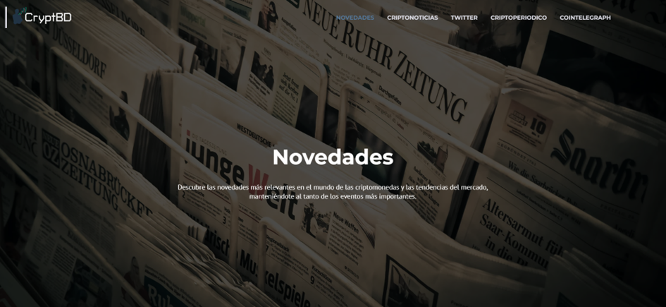
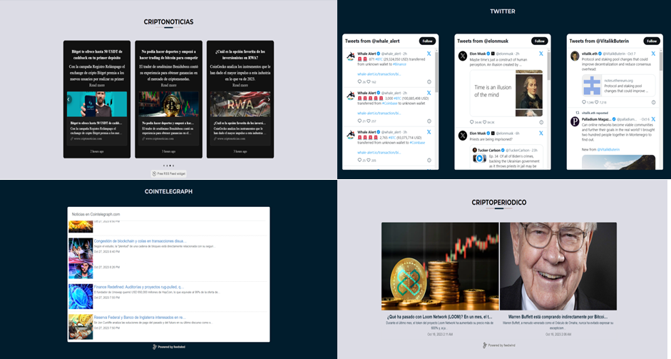

# News

The "News" module serves as a real-time information source about the world of cryptocurrencies. Its primary goal is to provide users with a platform to stay updated on the latest events.

This module offers a visually appealing and highly intuitive set of shortcuts to various cryptocurrency news sources. Users can explore tweets from influential figures in the crypto community and view alerts about large money transfers, providing real-time insights into market trends and important events.

