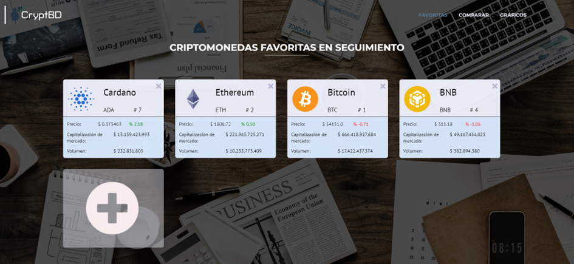

# Watchlist

In this module, users can access the list of coins they have marked as favorites for personalized tracking. In addition to viewing these coins, users have the option to compare them and generate charts for detailed analysis. Below, we describe these functionalities.

## Favorites

Firstly, a list of the coins that the user has marked as favorites is presented, offering the flexibility to remove those that are no longer of interest or to add new ones. Each coin is represented as a card, and these cards provide a series of fundamental data, including the current price, market capitalization, and trading volume.

By clicking on one of these cards, the system will redirect you to the "Specific Coin" module, allowing you to explore the selected coin in more detail. This functionality provides quick and easy access to detailed information about favorite coins.

## Comparative Charts

In this section of the template, users have the ability to select a minimum of two and up to four coins to generate comparative charts. It is important to note that these coins must be previously added to the user's favorites list to be compared.

It is relevant to mention that, since this functionality is in a beta version of the system, a sixty-second timer has been implemented. This measure aims to prevent multiple API requests within a short period of time.

The generated charts offer a wide range of relevant information for coin analysis. Below are the types of comparative charts available:

#### Circulating Supply and Maximum Supply

This comparative chart provides a view of the maximum and total circulating supplies of each selected coin.

#### Market Capitalization

Provides a comparative chart of the total market capitalization of each coin, facilitating the evaluation of their relative position in the market.

#### Volume in the Last 24 Hours

A bar chart comparing the total trading volume for each coin over the last 24 hours, reflecting recent market activity.

#### Community Sentiment

Offers a comparative analysis of community sentiment in the last 24 hours regarding each coin, which can be indicative of its popularity and market perception.

#### Market Capitalization Over the Last Year

This area chart allows for comparing the market capitalization of each coin over the past year, helping to identify long-term trends.

#### Volume Over the Last Year

Presents a bar chart comparing the trading volume over the past year for each coin, providing a historical perspective on its market activity.

These comparative charts offer users a powerful tool to analyze and compare different aspects of coins, allowing them to make more informed decisions in their investments and market tracking.
